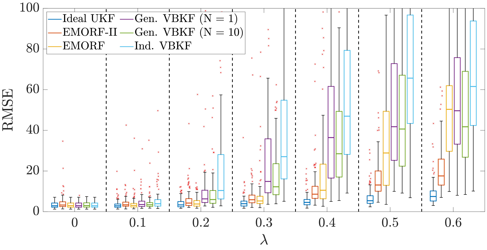
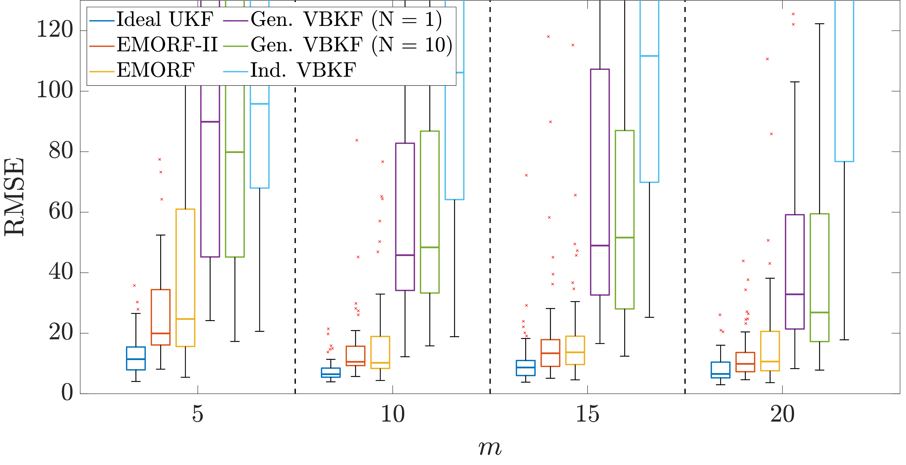
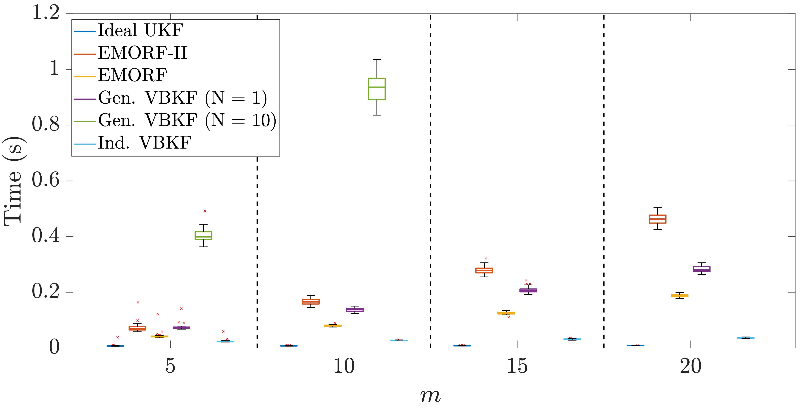

This repository contains the supplementary material for the paper "EMORF-II: ADAPTIVE EM-BASED OUTLIER-ROBUST FILTERING WITH CORRELATED
 MEASUREMENT NOISE" submitted to 2025 IEEE INTERNATIONAL WORKSHOP ON MACHINE LEARNING AND SIGNAL PROCESSING
 We also include the code for our simulations and our proposed method "EMORF-II".

 The proposed method is contained in the function EMORF-II.m
 The comparitive methods are also included as following

 robust_vbkf_ind_self_modular_ind_sens_nsensors_xpp.m --> Ind. VBKF
 robust_vbkf_self_modular_nsensors_10_xpp.m --> Gen. VBKF (N = 10)
 robust_vbkf_self_modular_nsensors_1_xpp.m --> Gen. VBKF (N = 1)
 ukf_ideal_self_modular_nsensors_xpp.m --> Ideal UKF
 robust_EMORF_self_modular_ind_sens_nsensors_xpp.m --> EMORF

You will need to add daboxplot to your folders and subfolders to run the following simulations

EMORF_II_Performance_Comparisons.m runs the simulation for comparing the accuracy of all the considered algorithms with increasing outlier occurrence probabilities
 denoted by λ and should produce the following Fig. 2 from the paper

EMORF_II_Increasing_Sensors_Comparison.m we evaluate the error performance of each algorithm with increasing
  m (number of sensors) and should produce the folliwing Fig. 3 from the paper

EMORF_II_Time_Comparison.m compares  the computational efficiency of each algorithm by measuring their running times
 with increasing m resulting in the Fig. 4 form the paper

 
 

  
 

 
 
 
